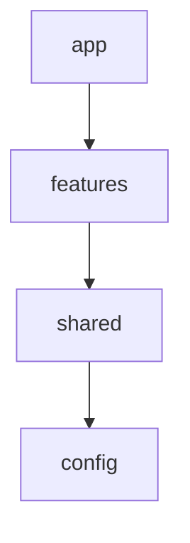
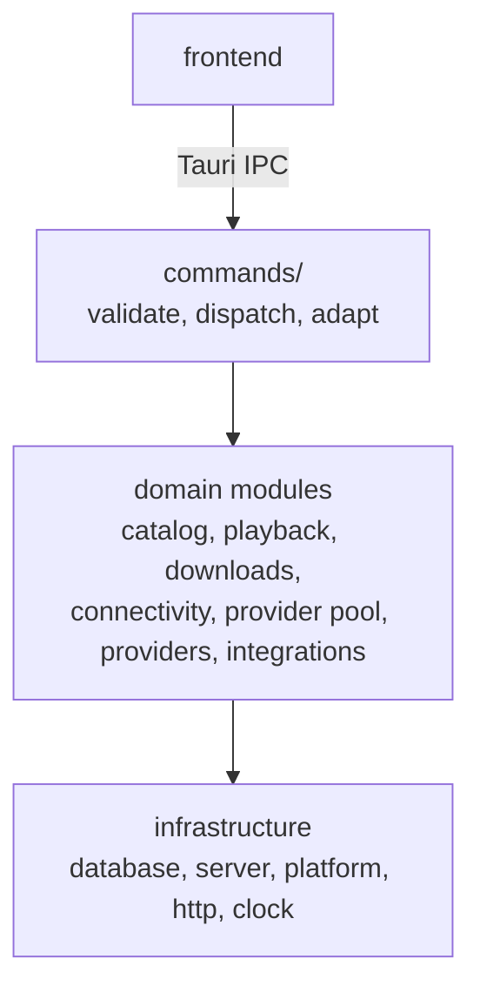

# Architecture Boundaries

This page answers one question: where does the next thing go. It describes the
structure that is actually in the repository, and every rule on it is enforced
either by `eslint.config.js` or by the project checks imported into Sonar. A
rule nobody checks is a rule that stops being true, so if you change a
boundary, change its check in the same commit.

See also [Architecture Overview](Architecture-Overview),
[Architecture Backend](Architecture-Backend),
[Providers Reference](Providers-Reference) and
[Data Sources](Data-Sources).

---

## The two halves

```
src/          the interface, SolidJS + TypeScript
src-tauri/    the backend, Rust
```

They meet at exactly one place, the Tauri IPC boundary. On the frontend that is
`src/shared/ipc/`; on the backend it is `src-tauri/src/commands/`. Nothing else
on either side knows a command name.

---

## Frontend

### Layers



Imports point downwards only. A file's folder therefore tells you what it is
allowed to reach.

| Layer      | Owns                                                                 | May import           |
| ---------- | -------------------------------------------------------------------- | -------------------- |
| `app`      | booting, the shell, routes, onboarding, shutdown, the global event bridge | everything below     |
| `features` | one behaviour each                                                   | `shared`, `config`   |
| `shared`   | what more than one feature needs                                     | `shared`, `config`   |
| `config`   | named numbers and the reason they have that size                     | nothing              |

`shared` may not import `features` or `app`. `features` may not import `app`.
`config` imports nothing at all, which is what makes it safe to read from
anywhere.

### Inside a feature

| Folder | Holds |
|---|---|
| `model/` | Pure decisions |
| `io/` | Resources, orchestration, side effects |
| `ui/` | SolidJS components |
| `tests/` | This feature's tests |

**`model/`** is deterministic. Same input, same output, no clock, no network, no
storage, no process-wide state, and no idea how its result will be drawn. ESLint
blocks it from importing `@/shared/ipc`, the stateful shared packages, any
`io/`, any `ui/`, and `createResource`. This is the part you can test without a
DOM, and most of the feature's real thinking should end up here.

**`io/`** owns everything `model/` is not allowed to touch: Solid resources,
IPC calls, timers, listeners, long-lived state. A factory here is named after
its lifecycle, `createX` for something the caller owns and disposes, `installX`
for something that attaches itself for the life of the window. It never renders.

**`ui/`** renders state and calls named operations from `io/`. It does not talk
to transport: a component that needs a backend call asks `io/` for one that has
a name. Component files are PascalCase and match the symbol they export.

**`tests/`** holds the feature's tests. There are no colocated `*.test.ts` files
anywhere in `src/`; the architecture test fails on one.

### What other features may read

A feature's `model/`, `io/` and `ui/` are its public surface. Anything else,
`tests/` in particular, is its inside and is not importable from elsewhere.

Cross-feature imports are allowed but should stay rare and one-directional. The
graph has no cycles and the architecture test keeps it that way. When two
features start needing the same thing, the answer is usually one of:

1. it is a small pure contract → `shared/`
2. it belongs to the destination, not the caller → move it there
   (route warming lives in `features/anime/io/warmRoutes.ts` for exactly this
   reason: the anime feature owns the routes being warmed)
3. it is composition → `app/`

### The `shared` rule

> Code belongs in `shared` only when it is genuinely application-independent, or
> when more than one independent feature needs it.

Convenience is not a reason. A shared package is named after the capability it
provides, never after a layer: there is no `shared/utils`, `shared/helpers`,
`shared/io` or `shared/model`, and the `feature-layout` Sonar project check reports one.

The packages, and what each is for:

| Package         | Provides                                                             |
| --------------- | -------------------------------------------------------------------- |
| `anime`         | what an anime record is and how a card decides to show it            |
| `cache`         | the SWR resource and the one safe way to read a settled one          |
| `catalog`       | the local catalogue's lifecycle: warmup, refresh, the change signal |
| `colour`        | contrast and colour-space conversion                                 |
| `easter-egg`    | the SBR trigger and the brand it leaves on a profile                 |
| `errors`        | the error taxonomy shared with `src-tauri/src/foundation/error.rs`   |
| `formatting`    | durations, numbers, text                                             |
| `i18n`          | the locales and `translate()`                                        |
| `images`        | proxied URLs, steady loading, the accent sampled from a cover        |
| `ipc`           | the Tauri command surface                                            |
| `keyboard`      | typing targets and type-to-open                                      |
| `logging`       | the logger and its redaction                                         |
| `media`         | HTML media-element handling                                          |
| `network`       | latency and reachability                                             |
| `notifications` | the notification store and its sound                                 |
| `platform`      | the window, the updater, Discord presence, the engine                |
| `preferences`   | everything persisted about how the app looks and behaves             |
| `providers`     | which streaming sources exist and which are switched off             |
| `reactive`      | small Solid primitives                                               |
| `track`         | the four sub/dub × en/de tracks and which one an episode opens in    |
| `ui`            | components that work without knowing what an anime is                |

`shared/ui` is for components that could be used by an application that has
never heard of anime. A component that knows about the player, the library or a
download belongs to that feature.

Two packages publish a deliberate entry point and keep the rest internal:
`shared/ipc/index.ts` and `shared/catalog/index.ts`. Elsewhere there are no
barrels, because a barrel that exists only for tidiness costs tree-shaking and
buys nothing.

### `shared/ipc`

Every Tauri command name and argument shape in the frontend is written down
here, once. `invoke()` is banned everywhere else, by ESLint, including in
components. The path from a click to the backend is:

```
ui  →  feature io  →  shared/ipc  →  Tauri
```

The name is `ipc` and not `api` on purpose. AniList, Kitsu and the
providers are all APIs too. This folder is the boundary to our own Rust
process, and nothing else.

### `app`

`app` is the composition root and nothing else. It boots the application, owns
the shell, composes routes, bridges backend events, runs onboarding, and shuts
down. Feature logic does not move up into it, and composition does not move down
into `shared`.

---

## Rust

### Flow



### `commands/` is an adapter layer

A command reads its arguments, normalises them, calls one domain function and
returns. It is not where the work happens. Three checks hold this:

- `#[tauri::command]` appears only under `commands/`.
- `tauri::State` is unwrapped only under `commands/`. A domain function takes
  what it needs as an argument, so it can be tested without a Tauri handle.
- Nothing outside `commands/` and `app/` imports `crate::commands`. A domain
  module that calls a command has its dependency backwards.

`app/ipc.rs` additionally proves at test time that every declared command is
registered in the handler.

### The domain modules

| Module           | Owns                                                                        |
| ---------------- | --------------------------------------------------------------------------- |
| `catalog`        | the local anime catalogue: sync, metadata enrichment, artwork, seasons and ratings |
| `playback`       | which episodes exist, what they are called, and which link to play           |
| `downloads`      | the queue, transfers, ffmpeg, the offline library                            |
| `connectivity`   | whether each service answers, and where the connection is                    |
| `providers`      | one directory per streaming source: its transport, its parsing, its mapping  |
| `provider_pool`  | choosing between providers: racing, health, circuit breaking, title matching |
| `integrations`   | third-party services that are not streaming providers: AniList, Kitsu, AniSkip, Discord, imports and IP geolocation |

The split between `providers` and `provider_pool` is deliberate and worth
keeping: an implementation of a source never decides whether it is the source
that gets used.

### Infrastructure

| Module     | Owns                                                                |
| ---------- | ------------------------------------------------------------------- |
| `database` | SQLite: schema, migrations, and read models grouped by subject       |
| `server`   | the local media proxy and image cache                                |
| `platform` | behaviour that differs per operating system, plus disk and storage accounting |
| `app`      | Tauri setup: plugins, managed state, window, tray, command registration |

Domain modules call the database. The database holds no feature policy of its own.

### `foundation`

What every other module may assume exists, and what nothing above it may reach
back into:

| File | What it owns |
|---|---|
| `error.rs` | `AppError` and the stable error codes the frontend matches |
| `http.rs` | The one browser identity every outbound request presents |
| `clock.rs` | The crate's only reading of the wall clock |
| `pattern.rs` | Compiling the regular expressions written as literals here |

Nothing in `foundation` knows about anime, providers or downloads.

The crate root itself holds `lib.rs` and `main.rs` and nothing else. The
`root-layout` and `clock-boundary` Sonar project checks report a module that
lands beside them or a second `now()` anywhere in the crate.

### Rust tests

Production code carries `#[cfg(test)] #[path = "../tests/<subsystem>/<file>.rs"]
mod tests;`, and every test file lives under `src-tauri/src/tests/`, mirroring
the module it covers. Small unit tests written directly against private
functions may stay inline at the bottom of their file.

---

## Where tests go

| Kind                                                     | Location                    |
| -------------------------------------------------------- | --------------------------- |
| a feature's own tests                                     | `src/features/<name>/tests/` |
| a shared package's tests                                  | `src/shared/<package>/tests/` |
| the app layer's tests                                     | `src/app/tests/`, `src/app/onboarding/tests/` |
| repository invariants: architecture, docs, locales, assets, error codes | `scripts/sonar/project-checks.mjs` |
| Rust                                                      | `src-tauri/src/tests/`      |

Repository invariants are static Sonar project checks rather than executable
Vitest suites: the layers point the right way, every file explains itself, both
sides name the same error codes, no copy is hardcoded, and every referenced
asset exists. `npm run sonar:checks` writes them as a generic issue report;
`npm run sonar` imports that report into the project analysis.

---

## Naming

- Name a module after its subject, never after its layer. `episodeProgress.ts`,
  not `utils.ts`; `providerSelection`, not `manager`.
- A file does not repeat a folder it already sits in: `player/io/playback.ts`,
  not `player/io/playerPlayback.ts`.
- IO factories are `createX` or `installX`, after their lifecycle.
- Components are PascalCase and named after what they render.
- Every file opens with a `@fileoverview` (TypeScript) or `//!` (Rust) saying
  what is inside and, where it is not obvious, why it is that way. Every export
  in `io/` and `model/`, and every crate-public Rust item, carries a comment.

---

## Enforcement

| Rule                                                        | Enforced by                      |
| ----------------------------------------------------------- | -------------------------------- |
| `shared` and `features` cannot import upwards               | `eslint.config.js`               |
| `config` imports nothing                                    | `eslint.config.js`, `fileDocs`   |
| `model/` is pure                                            | `eslint.config.js`               |
| `ui/` does not touch transport                              | `eslint.config.js`               |
| `invoke()` only in `shared/ipc`                             | `eslint.config.js`               |
| no import cycles                                            | Sonar `import-architecture`      |
| features reach only another feature's `model`/`io`/`ui`     | Sonar `import-architecture`      |
| tests live in `tests/` folders                              | Sonar `test-location`            |
| commands are adapters                                       | Sonar `tauri-command-boundary`   |
| nothing loose at either root                                | Sonar `root-layout`              |
| assets sorted by kind                                       | Sonar `root-layout`              |
| comments describe code, not its history                     | Sonar `comment-style`            |
| no em dash, no clause-joining semicolon                     | Sonar `comment-style`            |
| no query takes a list of ids                                | Sonar `anilist-policy`           |
| the metadata cache declares a ceiling                       | Sonar `anilist-policy`           |
| every command is registered                                 | `app/ipc.rs`                     |
| one clock                                                   | Sonar `clock-boundary`           |
| shared packages name capabilities                           | Sonar `feature-layout`           |
| every file and public export documented                     | Sonar `file-documentation`       |
| error codes match across the boundary                       | Sonar `error-contract`           |

Generate all repository-specific findings with `npm run sonar:checks`, then run
the complete local analysis as described under [SonarQube](SonarQube).
