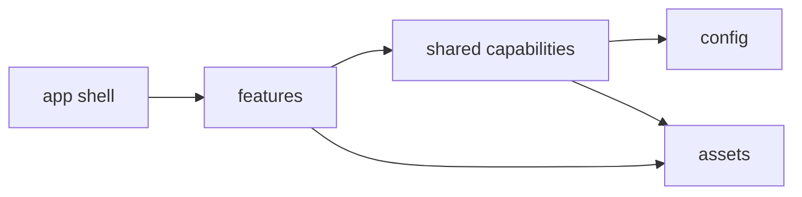
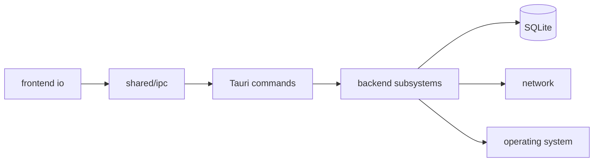

# Architecture Overview

AniSphere is a [Tauri 2](https://tauri.app) desktop application. Rust owns durable data, remote
services, media transport, downloads and operating-system integration. SolidJS owns presentation
and transient interaction state. Typed Tauri commands are the boundary between them.

## Dependency direction

Dependencies point toward stable policy and never back toward composition:

Across the process boundary the same rule holds, and every arrow crosses it once:

ESLint and architecture tests enforce the important edges. In particular, UI cannot invoke the
backend, feature models cannot import IO or UI, shared code cannot import a feature, and config has
no imports at all.

## Frontend map

| Directory | Responsibility |
|---|---|
| `src/app/` | Process boot, route composition, application-wide event wiring and the shell |
| `src/features/` | Vertical product capabilities such as anime, player, library and settings |
| `src/shared/` | Stable capabilities deliberately used by more than one feature |
| `src/config/` | Named tuning values: timings, limits and layout measurements, with their rationale |
| `src/assets/` | Static data shipped with the application, including world-country geometry |

Every feature uses the same four-folder vocabulary:

| Feature folder | Owns |
|---|---|
| `ui/` | Solid components and rendering-only helpers |
| `io/` | Resources, persistence, platform calls and lifecycle orchestration |
| `model/` | Pure decisions, transformations, types and state machines |
| `tests/` | Feature behaviour and interaction tests |

This is a vertical-slice architecture, not a repository-wide collection of controllers and
components. A contributor looking for player behaviour starts in `features/player` and can see its
rendering, effects and decisions together.

Shared code is not divided into generic `io` and `model` buckets. Its top-level folders name the
capability they offer: `api`, `media`, `network`, `preferences`, `track`, `i18n`, `ui` and
the other packages documented in [Frontend Architecture](Architecture-Frontend). This makes an
import explain why the dependency exists.

## Backend map

Under `src-tauri/src/`:

| Directory | Responsibility |
|---|---|
| `app/` | Starts Tauri, registers commands and owns native-window behaviour |
| `catalog/` | Imports the title catalogue, and fetches remote metadata for what a screen is showing |
| `commands/` | Thin, serializable IPC boundary grouped by subject |
| `database/` | SQLite schema, migrations, persisted models and query families |
| `providers/` | One streaming-site adapter per folder behind a common contract |
| `provider_pool/` | Matching, health, failover and caching across providers |
| `server/` | Loopback image, local-file and media proxy |
| `downloads/` | Queue, transfer, FFmpeg assembly and offline snapshots |
| `integrations/` | AniList, Kitsu, Discord presence, AniSkip and imports |
| `platform/` | Operating-system-specific behaviour behind one surface |

Every Rust file starts with inner module documentation (`//!`). Crate-public items use `///` so
their contract is readable without opening the implementation.

## Who owns which fact

| Fact | Owner | Not the owner |
|---|---|---|
| Which anime exist, their titles and ids | manami catalogue | AniList, providers |
| How many episodes a season has, when it airs | AniList | providers |
| Which episodes can actually be played | selected provider | AniList |
| Per-episode titles and thumbnails | Kitsu, with AniList fallback | providers |

An AniList episode count is not proof that a provider can play that episode. The UI may show a
metadata count and a playable episode list that disagree. Collapsing the two would invent a link
that is not there.

## Compatibility contracts

The following require an explicit migration or product decision, not a structural refactor:

- Tauri command names and payload shapes
- Event names and payloads
- Persisted data, settings keys and avatar seeds
- Provider ids and provider order
- Routes and deep links
- Cleanup behaviour on profile switch and shutdown

Database migrations are additive. Columns are added before the indexes that depend on them, and
user data is never recreated merely because a schema version changed.

## Further reading

- [Frontend Architecture](Architecture-Frontend)
- [Backend Architecture](Architecture-Backend)
- [Provider System](Provider-System)
- [Playback and Proxy](Playback-And-Proxy)
- [Downloads and Offline](Downloads-And-Offline)
- [Data, Privacy and Security](Data-Privacy-And-Security)
