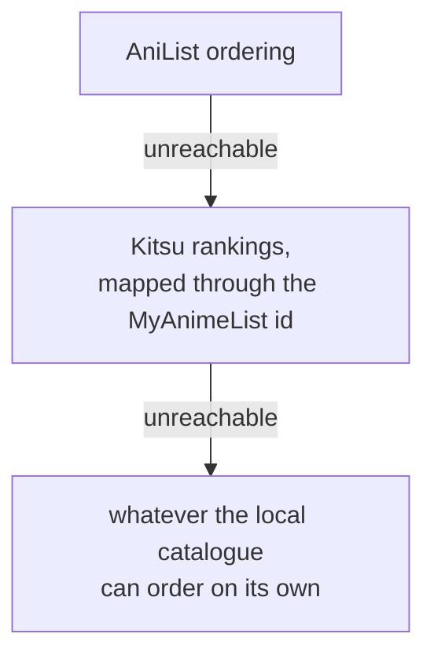

# Data Sources

AniSphere owns no anime data. Everything it shows comes from somewhere else, and
this page says from where, how often it is asked, and what is kept. If you are
here because you run one of these services and want to know what this client
does to you, that is exactly what this page is for.

See also [Attribution](https://github.com/xeidral/anisphere/blob/main/.github/ATTRIBUTION.md)
and [Data, Privacy and Security](Data-Privacy-And-Security).

---

## The rule

**Fetch what the viewer is looking at. Never walk a catalogue.**

The difference is not about volume, it is about intent:

| This is a client | This is not |
|---|---|
| Fetching a title because someone opened it | Fetching every title because they exist |
| Asking for a ranked page and showing it | Rebuilding the ranking from a local copy |
| Caching an answer so the next visit is instant | Keeping a copy that never expires |

The [AniList terms](https://github.com/AniList/ApiV2-GraphQL-Docs/blob/master/docs/guide/terms-of-use.md)
forbid the right-hand column in two separate clauses, and they are right to.
Two repository-specific Sonar checks report a violation of it:

- a query document may take a list of ids from the account or from the screen,
  and from nowhere else. That is the shape that makes walking a catalogue cheap
- the metadata cache declares a row ceiling, which is what makes it a cache

---

## Where each thing comes from

| Source | Asked | Kept |
|---|---|---|
| **manami** `anime-offline-database` | once per release, as one file | The whole local catalogue: titles, synonyms, covers, the AniList to MyAnimeList id bridge, runtime, studios, producers, and whether a title is Chinese animation |
| **AniList** `graphql.anilist.co` | one request opens the home screen, one opens an uncached detail page, one opens the schedule, one per seasonal year | Only what was shown, in a cache bounded to 5000 titles |
| **AniSkip** dump | once per commit of the published file, as one file | 73000 opening and ending markers |
| **AniSkip** API | only for an episode the dump does not cover | the answer, for that episode |
| **Kitsu** | when AniList cannot answer, or an episode list needs titles and stills | fallback details, rankings, episode titles and stills |
| **ani.zip / TMDB** | when a detail page wants a title treatment | for a month |

Manami's Chinese-animation tag is retained at import. When a visible search page is hydrated,
AniList's `countryOfOrigin` confirms or corrects that flag and the local query is run again before
the page is published.

### The home screen is one request

Four rankings, fifty titles each, and the spotlight slides, in a single
GraphQL document. Only the *ordering* is taken from the answer. Every card is
drawn from the local catalogue, so the request buys the one thing a local
catalogue cannot know.

The ordering is stored. Under six hours old it is served without asking anyone.
Older, it is served immediately and refreshed behind the reader. That is also
what makes the home screen work with AniList down, and there are two more rungs
below it:

### The metadata cache has a ceiling

`anime_details` holds what was fetched for titles somebody opened. At startup
the least recently fetched rows above 5000 are dropped, with anything in the
library exempt. A cache without a ceiling is a copy, and a copy is the thing
that was forbidden.

Settings reports it separately from the picture cache and can empty either one.

### Rate limits are respected, not merely survived

Every AniList caller in the process, including the authenticated list sync and
the connectivity probe, queues through one pacer, because the budget is counted
per address. The stated limit is adopted from `X-RateLimit-Limit` and spent at
85 percent. When `X-RateLimit-Remaining` reaches four, every caller waits the
window out rather than running it down to a refusal. A `Retry-After` holds all of
them back, not only the one that was refused.

There is also one HTTP client rather than one per request, so the connections
it opens are reused. That matters most where requests are unavoidably sequential:
working out the seasons of a series follows the relation links one title at a
time, and building a fresh client per hop made each of them pay for its own TLS
handshake before it could ask anything. Those two directions, back to the first
season and on to the last, are now followed at the same time as well.

The client calls itself `AniSphere/2.0.0` and links here, so AniList can see
which client is asking and reach whoever runs it.

---

### The library reconcile is on a five-minute tick, and your own edits are not

A connected account is a syncing account: there is no switch, because there is
nothing sensible for "off" to mean once you have connected one.

What you do here goes out **immediately**, on a fifth of a second of debounce.
Filing a title, scoring it, finishing an episode: none of that waits for a tick.
The periodic reconcile exists for the other direction, changes made on the
AniList website, and it runs every five minutes.

It also runs once at startup, as soon as a profile has been chosen rather than
after a fixed delay, and again whenever the window comes back from the tray,
where nothing in the page fires on its own. Pressing the AniList badge above the
library reconciles on the spot.

It used to run every fifteen seconds. Each tick is two authenticated requests
against the same per-address budget every other AniList caller shares, which is
around four hundred an hour spent watching a list that changes a few times a
day. Detail pages, artwork and season chains queue behind those, and when the
budget runs down to its reserve every caller waits out the window. Five minutes
buys that back without costing you anything you did yourself.

## What is never sent

No account identity, no watch history, and no telemetry of any kind leaves the
machine, except to the one service the viewer explicitly signed into: an AniList
login syncs that viewer's own list, which is the entire point of signing in.

Nothing about which anime you watch is sent anywhere else. There is no analytics
endpoint, and there is nothing to opt out of.
