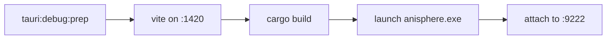

# Development Setup

Everything below assumes you have cloned the repository and are sitting in its root.

```bash
git clone https://github.com/xeidral/anisphere
cd anisphere
```

## What you need installed

**Node.js 20 or newer.** Check with `node --version`.

**Rust, stable channel,** through [rustup](https://rustup.rs). The default toolchain already
carries `rustfmt` and Clippy, so `rustup default stable` is the whole setup. Check with
`cargo --version`.

**Your platform's Tauri dependencies.** The
[Tauri prerequisites guide](https://tauri.app/start/prerequisites/) is the authority, and the
short version is:

| Platform | What is missing on a fresh machine |
|---|---|
| Windows | Microsoft C++ Build Tools, and the WebView2 runtime that Windows 11 already ships |
| macOS | The Xcode command line tools, `xcode-select --install` |
| Linux | `webkit2gtk`, `libappindicator`, `librsvg` and the usual build essentials |

## Prepare the checkout

There is no setup script. Install the repository dependencies with the package and Rust tools
directly:

```bash
npm ci
rustup component add rustfmt clippy
cargo fetch --manifest-path src-tauri/Cargo.toml
```

`npm ci` uses the committed lockfile and leaves `node_modules` ready for the application scripts.
If Windows reports a locked file, stop every running dev server or AniSphere process and run it
again.

Copy the public build-time values into a local environment file:

::: code-group

```bash [macOS and Linux]
cp .env.example .env
```

```powershell [PowerShell]
Copy-Item .env.example .env
```

:::

## First run

```bash
npm run tauri:dev
```

The first `tauri:dev` compiles the Rust side, which takes a few minutes on a cold machine and
seconds after that.

The first launch also downloads the catalogue, a little over twenty thousand titles from
[manami-project](https://github.com/manami-project/anime-offline-database), and writes them into
a local SQLite file. That happens once. Every later start reads from disk.

## What `npm run tauri:dev` actually does

Four things, in order:

1. Loads `.env` if there is one. A variable already set in your shell wins over the file.
2. Runs the test gate. Only the side you edited runs, so a second start in a row is instant.
3. Starts Vite on port 1420 with hot reload for the interface.
4. Builds and launches the native window against that dev server.

Edit anything under `src/` and the window updates without restarting. Edit anything under
`src-tauri/` and you stop and start again, because that half is compiled Rust.

### Skipping the gate

```bash
npm run tauri:dev -- --no-tests
```

Also accepted as `--no-test`, or by setting `ANISPHERE_SKIP_TESTS=1`. Use it when you already
know the suite is green and want the window up now.

The opposite exists too. `--all-tests` ignores the change detection and runs both suites whatever
the tree looks like.

| Command | Runs |
|---|---|
| `npm run tauri:dev` | Only the side you edited since the last green run |
| `npm run tauri:dev -- --no-tests` | Nothing, straight to the window |
| `npm run tauri:dev -- --all-tests` | Frontend and Rust every time |

The `--` matters. It tells npm the flag belongs to the script rather than to npm itself.

The change detection fingerprints `src/`, `scripts/`, the Vite and TypeScript configuration and the
package lock separately from `src-tauri/src/` and the Rust manifests. It stores the last green
values under `node_modules/.cache/anisphere/`. A side is recorded only after it has passed, so a
red suite is never skipped on the next start. Delete that folder to force a full run.

### Interface work without the native shell

```bash
npm run dev
```

Vite alone, in your browser, on `http://localhost:1420`. Every backend call fails there because
no Tauri runtime sits behind it, so this is useful for pure layout and styling and nothing else.

## Configuration

Copy `.env.example` to `.env`. Every value in that file is already filled in and every one of
them is public, because they all ship inside the released binary anyway. There is nothing to
request and nothing to keep secret.

| Value | Read at | Purpose |
|---|---|---|
| `ANISPHERE_ANILIST_CLIENT_ID` | compile time | The AniList application the login points at |
| `ANISPHERE_DISCORD_APP_ID` | compile time | The Discord application the presence is published under |
| `ANISPHERE_DISCORD_IMAGE` | compile time | Publicly reachable image used as the presence badge |
| `ANISPHERE_UPDATER_ENDPOINT` | bundle time | HTTPS URL of the update manifest |
| `ANISPHERE_UPDATER_PUBKEY` | bundle time | Public key that verifies update signatures |

Leave any of them blank and the matching feature switches off. Blank the AniList id and the login
button disappears, blank both updater values and the app stops checking for updates. Nothing else
changes.

The AniList login uses the implicit grant, the OAuth flow meant for clients that cannot keep a
secret. A desktop binary is exactly that, so no client secret exists anywhere in this repository.
See [Data, Privacy and Security](Data-Privacy-And-Security).

## Debugging in VS Code

The repository carries a working debug setup for both halves of the app at once: breakpoints in
Rust and breakpoints in TypeScript, in one session, from one keypress.

A checkout already has it in `.vscode/`. To drop it into another one, these are the two files:

<div class="download-row">
  <a class="download-card" href="/vscode/launch.json" download>
    <span class="download-name">launch.json</span>
    <span class="download-hint">the three debug configurations</span>
  </a>
  <a class="download-card" href="/vscode/tasks.json" download>
    <span class="download-name">tasks.json</span>
    <span class="download-hint">the build steps they depend on</span>
  </a>
</div>

Both go in a `.vscode/` folder at the root of the checkout.

### Extensions

Two, and the debugger does not start without them. Install them from VS Code's extension view:

- [rust-analyzer](https://marketplace.visualstudio.com/items?itemName=rust-lang.rust-analyzer)
- [C/C++](https://marketplace.visualstudio.com/items?itemName=ms-vscode.cpptools) on Windows, for
  the `cppvsdbg` debug type. On macOS and Linux install
  [CodeLLDB](https://marketplace.visualstudio.com/items?itemName=vadimcn.vscode-lldb) instead and
  change the `type` of the Rust configuration to `lldb`.

### The three configurations

| Name | What it does |
|---|---|
| **Debug AniSphere (Rust + UI)** | The one you press F5 on. A compound that starts the other two together. |
| Rust backend | Launches the debug binary with `RUST_LOG=info,anisphere_lib=debug` and opens the WebView2 remote debugging port. |
| WebView frontend | Attaches to that port so TypeScript breakpoints bind. |

The two halves are marked hidden. Running either alone gives you half a debugger, so only the
compound appears in the dropdown.

### Pressing F5



The `tauri:debug:prep` task runs first. It brings Vite up and waits for it to report ready, then
builds the Rust binary. Once that finishes VS Code launches the binary and attaches the WebView
debugger.

A cold `cargo build` takes a few minutes. The attach timeout allows two of them for that reason,
and if you still time out, run `cargo build --manifest-path src-tauri/Cargo.toml` once by hand
and press F5 again.

Then set breakpoints anywhere. One in `src-tauri/src/commands/` and one in the `src/features/`
code that calls it both bind in the same session, so you can step across the IPC boundary in a
single run.

### Debugging one test

The third configuration, **Vitest: current file**, runs whichever file is focused in the editor
under the debugger. Open a test, set a breakpoint, pick it from the dropdown.

For Rust, rust-analyzer puts a `Debug` lens directly above every `#[test]` function. Click it.

### Reading logs instead

The backend writes to stdout, so a plain `npm run tauri:dev` shows it in the terminal. Turn the
volume up with `RUST_LOG`:

```bash
RUST_LOG=debug npm run tauri:dev
```

On PowerShell that is `$env:RUST_LOG = "debug"` on a line of its own first.

Frontend logs go to the WebView console. Right click inside the window and choose Inspect, or
press F12 in a debug build.

## Before you open a pull request

```bash
npm run ci:local
```

Ten steps in the order CI runs them, stopping at the first failure: the tooling contracts,
TypeScript, Prettier, ESLint at zero warnings, Knip for unused code, the frontend suite, the
frontend build, `cargo fmt --check`, the offline Rust suite, and Clippy at `-D warnings`.

Green here is green on CI. [Testing](Testing) covers the individual layers and
[Coding Standards](Coding-Standards) covers what a review looks at.

## Building installers

```bash
npm run tauri:build
```

An NSIS installer and an MSI on Windows, a `.dmg` and an `.app` on macOS, a `.deb` and an
`.AppImage` on Linux. Output lands in `src-tauri/target/release/bundle/`.

| Goal | Command |
|---|---|
| Hot reload while working | `npm run tauri:dev` |
| Debug bundle with symbols kept | `npm run tauri:build -- --debug` |
| Release bundle | `npm run tauri:build` |

The release profile aborts on panic, uses link-time optimization and a single codegen unit,
builds for size and strips symbols. That combination is what keeps the binary small, and it is
also why the first release build is slow. [Build Notes](Build-Notes) has the numbers.
